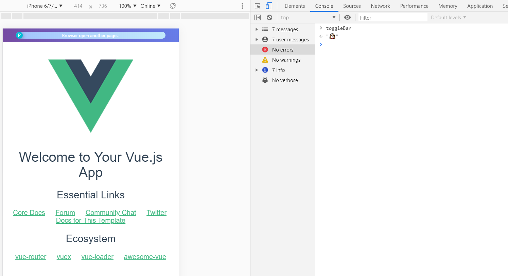
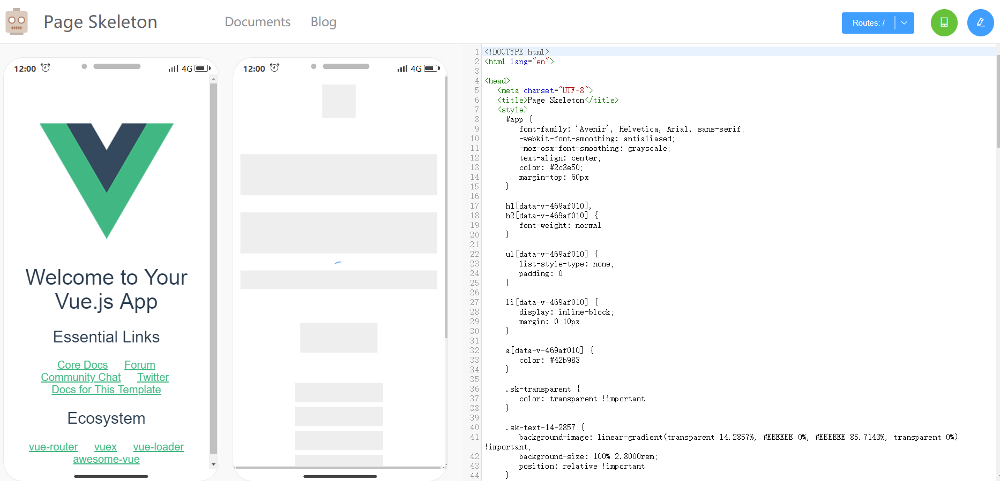

# demo

> A Vue.js project

## Build Setup

``` bash
# install dependencies
npm install

# serve with hot reload at localhost:8080
npm run dev

# build for production with minification
npm run build

# build for production and view the bundle analyzer report
npm run build --report
```

For a detailed explanation on how things work, check out the [guide](http://vuejs-templates.github.io/webpack/) and [docs for vue-loader](http://vuejs.github.io/vue-loader).

## 给项目页面添加骨架屏效果步骤

1. 安装骨架屏插件
        
		npm install --save-dev page-skeleton-webpack-plugin
		npm install --save-dev html-webpack-plugin
	
	如果项目已经安装过 html-webpack-plugin，只需安装 page-skeleton-webpack-plugin 即可。

2. 配置 page-skeleton-webpack-plugin 插件

	首先：在webpack配置文件里添加如下配置，webpack.dev.conf.js 和 webpack.prod.conf.js 都要添加。

		const { SkeletonPlugin } = require('page-skeleton-webpack-plugin')

		plugins: [
			new SkeletonPlugin({
				pathname: path.resolve(__dirname, '../shell'), // the path to store shell file
				staticDir: config.build.assetsRoot, // the same as the `output.path`
				routes: ['/', '/list'], // Which routes you want to generate skeleton screen
				port: '7890',
			})
		]

	注意：上面配置的 pathname 是存放骨架屏代码文件的目录，需要自己创建。

	然后，在 index.html 添加 `<!-- shell -->`

		<!DOCTYPE html>
		<html lang="en">
		<head>
			<meta charset="UTF-8">
			<title>Document</title>
		</head>
		<body>
			<div id="app">
				<!-- shell -->
			</div>
		</body>
		</html>

3. 在开发环境预览骨架屏效果，并生成骨架屏代码文件

	运行 npm run dev, 在开发页面控制台输入 toggleBar, 然后按下回车调出交互界面。



	点击 preview skeleton page 预览骨架屏效果，如下图：



	点击上图中右上角写入按钮，即可在前面配置的 pathname 目录下生成骨架屏代码文件。

4. 打包代码

	运行 `npm run build` 打包代码，


## 可能遇到的问题：

- 在安装page-skeleton-webpack-plugin时，可能遇到下载 Chromium 失败的问题。这个时候可以使用国内的 Chromium 源安装，或者使用 cnpm 安装。

		npm config set page-skeleton-webpack-plugin=https://npm.taobao.org/mirrors
		npm i page-skeleton-webpack-plugin

- 运行 npm run dev 时，报错：Cannot find module 'webpack-log'，此时安装webpack-log 之后重新运行即可。

		npm i --save-dev webpack-log

- 运行 npm run build 打包之后，index.html 页面的 `<!-- shell -->` 代码没有被骨架代码替换。

